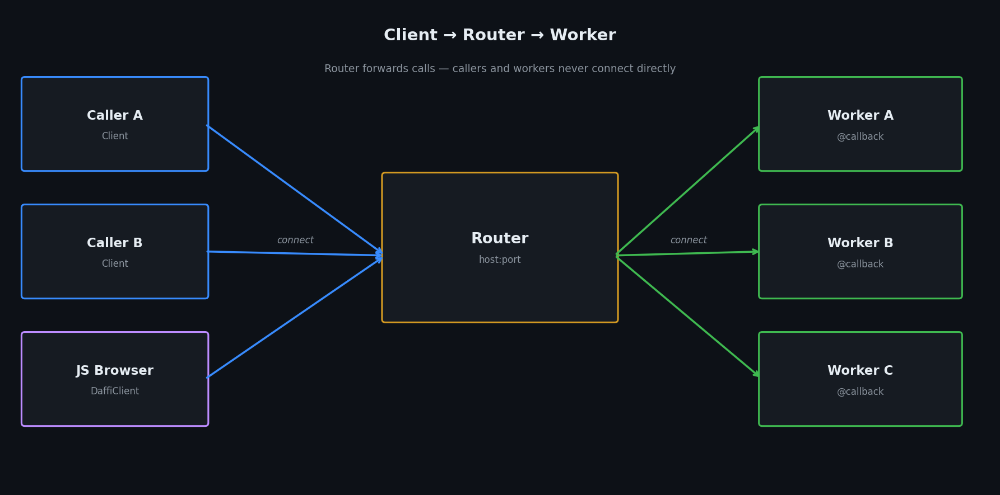

# Architecture

daffi supports two network topologies. Choose based on your deployment needs.

---

## Topology 1 — Client → Service


A **Service** listens on a TCP port (or Unix socket) and exposes functions decorated with `@callback`.  
A **Client** connects to the Service and calls those functions.

- The Service is the server; Clients are the callers.
- Multiple Clients can connect to the same Service simultaneously.

**When to use:**  
Simple request/response scenarios where one process (the Service) owns the logic and one or more clients consume it.

---

## Topology 2 — Client → Router → Worker



A **Router** is a pure message forwarder. It has no callbacks of its own.

**Workers** are Clients that connect to the Router and expose `@callback` functions.  
**Callers** are Clients that connect to the Router and call those functions.  
The Router matches calls to workers — callers and workers never connect directly.

- Workers can be added, removed, or restarted at runtime.
- The Router load-balances `rpc()` calls across all workers that expose the same function (round-robin).
- `cast()` fans out to *all* matching workers simultaneously.

!!! info "A single process can be both Caller and Worker"
    There is no restriction on roles. A process that registers `@callback` functions (acting as a Worker)
    can simultaneously call other workers' functions (acting as a Caller) — all over the same Router connection.
    This enables fully bidirectional, peer-to-peer communication patterns without any extra setup.

**When to use:**  
Scalable / distributed workloads, worker pools, fan-out broadcasting, bidirectional communication between arbitrary nodes.

---

## Key concepts

### `@callback`

`@callback` can decorate a **plain function** or an **entire class**.

```python
from daffi import callback
from daffi.registry import local

# ── plain function ────────────────────────────────────────────────────────────
@callback
def add(a: int, b: int) -> int:
    return a + b

# ── whole class ───────────────────────────────────────────────────────────────
@callback
class MathOps:
    def multiply(self, a: int, b: int) -> int:   # exported
        return a * b

    def _helper(self):                            # skipped — name starts with _
        pass

    @local
    def internal(self):                           # skipped — @local
        pass
```

When applied to a class daffi instantiates it (no-argument constructor) and registers every
**public** method as a remote callback. Methods whose names start with `_` and methods decorated
with `@local` are never exported.

### `rpc` vs `cast`


| | `rpc()` / `rpc_nowait()` | `cast()` / `cast_nowait()` |
|---|---|---|
| **Target** | One worker (round-robin or pinned by `receiver=`) | All workers that expose the function |
| **Returns** | Single result (or nothing for `_nowait`) | `{worker_name: result}` dict (or nothing) |
| **Use when** | Stateless computation, any worker will do | Fan-out notifications, aggregating results from all workers |

### Serialisation

daffi supports four wire formats — see [Serialization](usage/serialization.md).

| Format | Cross-language | Best for |
|---|---|---|
| `PICKLE` | No (Python only) | Python dataclasses, Enums, arbitrary objects |
| `JSON` | Yes | Simple dicts / lists, cross-language |
| `MSGPACK` | Yes | Binary-efficient alternative to JSON |
| `OPAQUE` | Yes | Raw bytes, custom encoding |
