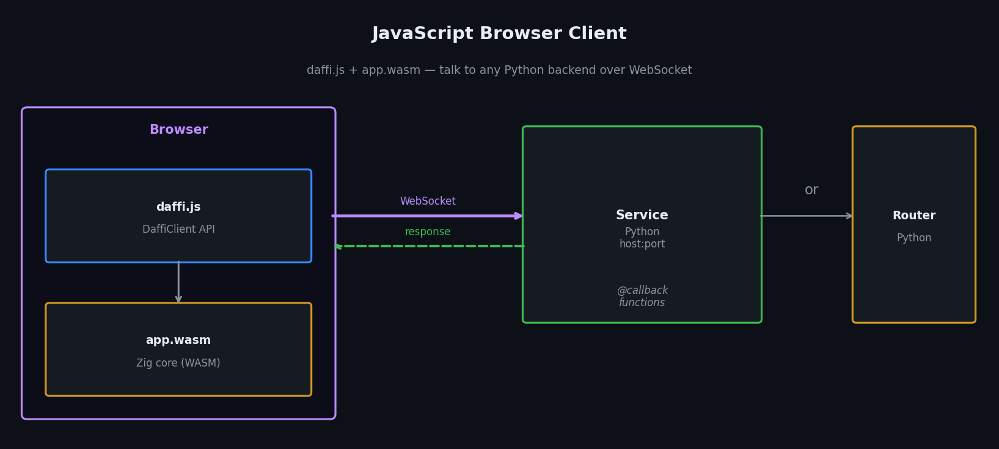

# JavaScript Client



daffi ships a browser JavaScript client (`daffi.js`) backed by a precompiled WebAssembly module (`app.wasm`) that speaks the native daffi wire protocol over WebSocket.

Both files live in `js-client/` of the repository and are also distributed via jsDelivr CDN.

---

## How it works

1. The browser loads `daffi.js` and fetches `app.wasm`.
2. `DaffiClient.connect()` opens a WebSocket to the Python backend (Service or Router) and performs the daffi handshake through the WASM core.
3. Every `rpc()` / `cast()` call goes through the WASM message builder, is sent over the WebSocket, and the response is decoded back through WASM.

The Python side sees the browser as a regular daffi Client — no special configuration needed.

---

## Loading from CDN

`daffi.js` is hosted on [jsDelivr](https://www.jsdelivr.com/) automatically from the GitHub repository.  
`app.wasm` is fetched automatically from the same CDN release — **you do not need to host or specify it yourself.**

```html
<!-- daffi.js client library (pinned to release 2.0.0) -->
<script src="https://cdn.jsdelivr.net/gh/600apples/daffi@2.0.0/js-client/daffi.js"></script>

<!-- Optional: msgpack-lite (only needed for serde: "msgpack") -->
<script src="https://unpkg.com/msgpack-lite/dist/msgpack.min.js"></script>
```

---

## DaffiClient API

### Constructor

```javascript
// Explicit name:
const client = new DaffiClient(name, options);

// Auto-generated name (e.g. "localhost-0x3f9a12bc"):
const client = new DaffiClient(options);
```

| Parameter | Type | Default | Description |
|---|---|---|---|
| `name` | `string` | `"hostname-0x<random>"` | Unique name for this browser client. When omitted, a name is generated automatically from `location.hostname` + a random 32-bit hex suffix. |
| `options.wsUrl` | `string` | **required** | WebSocket URL of the Python backend. No default — must always be provided explicitly (e.g. `"ws://127.0.0.1:5000"`). |
| `options.autoreconnect` | `boolean` | `false` | Reconnect automatically when the server drops the link. |
| `options.reconnectDelay` | `number` (ms) | `2000` | Base delay before the first retry. Doubles after each failure, capped at 60 s. |

!!! note
    `app.wasm` is loaded automatically from the CDN release that matches the `daffi.js` version — there is no `wasmPath` option.

### `client.connect()` → `Promise<Connection>`

Performs the daffi handshake and returns a `Connection` object.

```javascript
const conn = await client.connect();
```

### `client.stop()`

Close the connection permanently (no auto-reconnect, even if `autoreconnect` is enabled).

```javascript
client.stop();
```

### `client.addEventHandler(fn)`

Subscribe to server-side events. The handler receives `{ type, member }`.

```javascript
client.addEventHandler(event => {
    console.log(event.type, event.member);
    // "connected"    "worker-A"
    // "disconnected" "worker-A"
});
```

---

## Connection methods

All four call styles mirror the Python API exactly.

### `conn.rpc(options)` — one target, blocking

```javascript
const result = await conn.rpc({ timeout: 5000 }).add(3, 4);
// → 7
```

| Option | Type | Default | Description                          |
|---|---|---|--------------------------------------|
| `receiver` | `string` | `""` | Pin to a specific worker name.       |
| `timeout` | `number` (ms) | `null` | Reject if no reply within this time. |
| `serde` | `"json"` \| `"msgpack"` \| `"raw"` | `"json"` | Serialisation format.                |

### `conn.rpc_nowait(options)` — one target, fire-and-forget

```javascript
conn.rpc_nowait({ serde: "json" }).log_event({ page: "/home" });
```

Same options as `rpc()` — `timeout` is ignored.

### `conn.cast(options)` — all workers, collect results

Broadcasts to every connected worker that exposes the function.  
Returns a `Promise<{ workerName: result, … }>` dict — exactly like the Python `cast()`.

```javascript
const results = await conn.cast({ timeout: 5000 }).ping();
// → { "worker-A": "pong from worker-A", "worker-B": "pong from worker-B" }
```

| Option | Type | Default | Description                                   |
|---|---|---|-----------------------------------------------|
| `receiver` | `string \| string[]` | `null` | Restrict to these worker names. `null` = all. |
| `timeout` | `number` (ms) | `null` | Per-peer timeout.                             |
| `serde` | `string` | `"json"` | Serialisation format.                         |

### `conn.cast_nowait(options)` — all workers, fire-and-forget

```javascript
conn.cast_nowait({ serde: "json" }).notify("shutdown");

// Partial broadcast
conn.cast_nowait({ serde: "json", receiver: ["worker-B"] }).notify("targeted");
```

### `conn.stream(options)`

Alias for `rpc_nowait()`. Accepts generator functions for OPAQUE streaming:

```javascript
conn.stream({ serde: "raw" }).pipe(function* () {
    yield new Uint8Array([0x01, 0x02]);
    yield new Uint8Array([0x03, 0x04]);
});
```

### `conn.waitForMembers(members, options?)` — synchronise on worker availability

In a multi-worker environment the browser often connects before all Python workers
are online.  `waitForMembers()` **blocks (async) until every listed worker name
appears** in the Router's member registry, then resolves.  This lets you open
the page and start the workers in any order without adding manual delays or
error-retry loops.

```javascript
const conn = await client.connect();

// Wait until 'py-worker' is registered — resolves as soon as it connects.
await conn.waitForMembers('py-worker');

// The worker is guaranteed to be online now.
const result = await conn.rpc({ receiver: 'py-worker', timeout: 5000 }).process(7);
```

Multiple workers:

```javascript
// All three must be online before proceeding.
await conn.waitForMembers(['worker-A', 'worker-B', 'worker-C']);
const results = await conn.cast({ timeout: 5000 }).ping();
```

With a deadline:

```javascript
// Raises an Error after 30 s if not all workers appeared.
await conn.waitForMembers(['worker-A', 'worker-B'], { timeout: 30000 });
```

| Option | Type | Default | Description                            |
|---|---|---|----------------------------------------|
| `members` | `string \| string[]` | — | Worker name(s) to wait for.            |
| `options.timeout` | `number` (ms) \| `null` | `null` | Max wait in ms. `null` = wait forever. |
| `options.interval` | `number` (ms) | `1000` | Poll interval in ms.                   |

---

## Serialisation formats

| `serde` value | Description |
|---|---|
| `"json"` \| `1` | JSON (default). Works with any JS-serialisable value. |
| `"raw"` \| `0` | OPAQUE. Pass a `Uint8Array` or string; receive raw bytes. |
| `"msgpack"` \| `3` | Binary MessagePack. Requires `msgpack-lite` loaded before `daffi.js`. |

!!! note
    PICKLE (`2`) is Python-only and is not supported in the JS client.

---

## Automatic reconnection

Pass `autoreconnect: true` (and optionally `reconnectDelay`) when you want the
client to reconnect silently after a server restart.  The WASM module is
compiled once and reused — only the WebSocket is replaced on each attempt.

```javascript
const client = new DaffiClient("browser-caller", {
    wsUrl:          "ws://127.0.0.1:6001",
    autoreconnect:  true,   // reconnect automatically after disconnect
    reconnectDelay: 2000,   // first retry after 2 s; then 4 s, 8 s … (max 60 s)
});

const conn = await client.connect();

// conn reads the current connNum at call time — after a transparent reconnect
// the same conn object routes through the new connection automatically.
const result = await conn.rpc({ timeout: 5000 }).multiply(6, 7);
```

When a disconnect is detected, `socket.onclose` fires and the scheduler
retries with exponential back-off.  Outstanding RPC promises are rejected
immediately; new calls made after a successful reconnect use the fresh
connection.

Use `client.stop()` to close intentionally — this suppresses the
auto-reconnect loop.

---

## Securing the connection

Authentication and confidentiality are delegated to TLS — there is no
application-level password. Run the Python backend with `tls=True`
(plus `cert_file` / `key_file`) and connect from the browser using a
`wss://` URL:

```javascript
const client = new DaffiClient("my-app", { wsUrl: "wss://example.com:5000" });
const conn   = await client.connect();
```

The browser will refuse the upgrade unless the server presents a
certificate that chains to a CA the browser already trusts.

---

## Examples

| Example | Directory | Description |
|---|---|---|
| Service — JSON | `js-client/examples/01_service_json/` | Browser calls a Python Service with JSON. |
| Service — MSGPACK | `js-client/examples/02_service_msgpack/` | Same, using binary MSGPACK. |
| Router — JSON | `js-client/examples/03_router_json/` | Browser → Router → Python worker (JSON). |
| Router — MSGPACK | `js-client/examples/04_router_msgpack/` | Same, using binary MSGPACK. |
| cast() | `js-client/examples/05_cast/` | Broadcast to 3 workers, display result dict. |
| cast_nowait() | `js-client/examples/06_cast_nowait/` | Fire-and-forget broadcast to 3 workers. |
| waitForMembers() | `js-client/examples/07_wait_for_members/` | Block until a Python worker is online before calling it. |

### Running an example

1. Start the Python backend for the example, e.g.:
   ```bash
   python js-client/examples/01_service_json/1_service.py
   ```
2. Open `js-client/examples/01_service_json/index.html` directly in your browser.

---

## Minimal HTML template

```html
<!DOCTYPE html>
<html lang="en">
<head>
  <meta charset="UTF-8">
  <title>daffi demo</title>
  <!-- app.wasm is fetched automatically from the same CDN release -->
  <script src="https://cdn.jsdelivr.net/gh/600apples/daffi@2.0.0/js-client/daffi.js"></script>
</head>
<body>
<script>
(async () => {
  // wsUrl is required — there is no default
  const client = new DaffiClient("browser-client", {
    wsUrl: "ws://127.0.0.1:5000",
  });

  const conn = await client.connect();

  const result = await conn.rpc({ timeout: 5000 }).add(3, 4);
  console.log("add(3, 4) =", result);   // 7
})();
</script>
</body>
</html>
```
