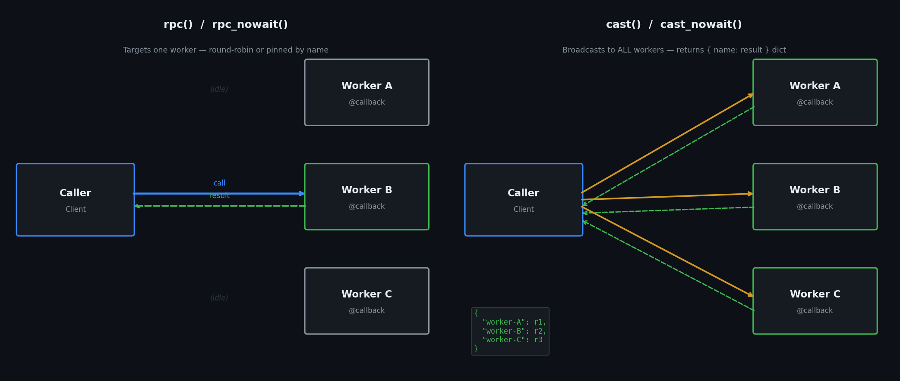

# Call Styles — rpc vs cast vs stream

daffi exposes five call styles on every `ClientConnection`. The diagram below summarises the key difference:



---

## `rpc()` — one worker, blocking

Sends the call to **one** worker. The Router selects the worker using round-robin; you can pin to a specific one with `receiver=`.  
**Blocks** until the result arrives (or the timeout expires).

```python
conn = caller.connect()

# Any available worker handles this.
result = conn.rpc(timeout=5).add(3, 4)
print(result)   # → 7

# Pinned to a specific worker.
result = conn.rpc(timeout=5, receiver="worker-A").add(3, 4)
```

| Option | Type | Default | Description |
|---|---|---|---|
| `timeout` | `float \| None` | `None` | Seconds to wait. `None` = wait forever. |
| `receiver` | `str \| None` | `None` | Pin to a specific node name. |
| `serde` | `SerdeFormat` | `PICKLE` | Serialisation format. |

---

## `rpc_nowait()` — one worker, fire-and-forget

Same as `rpc()` but returns `None` immediately — no result is waited for.  
Useful for logging, notifications, side-effects.

```python
conn.rpc_nowait().log_event({"type": "click", "page": "/home"})
```

| Option | Type | Default | Description |
|---|---|---|---|
| `receiver` | `str \| None` | `None` | Pin to a specific node. |
| `serde` | `SerdeFormat` | `PICKLE` | Serialisation format. |

---

## `cast()` — all workers, blocking

Sends the call to **every** connected worker that exposes the function, waits for all results, and returns a `{worker_name: result}` dict.

```python
# Fan out to all workers.
results = conn.cast(timeout=5).process("payload")
print(results)
# → {"worker-A": "done", "worker-B": "done", "worker-C": "done"}

# Restrict to a subset.
results = conn.cast(timeout=5, receiver=["worker-A", "worker-C"]).process("payload")
print(results)
# → {"worker-A": "done", "worker-C": "done"}
```

| Option | Type | Default | Description |
|---|---|---|---|
| `timeout` | `float \| None` | `None` | Per-worker timeout. |
| `receiver` | `str \| list[str] \| None` | `None` | Restrict to these worker names. `None` = all. |
| `serde` | `SerdeFormat` | `PICKLE` | Serialisation format. |

!!! note
    When using `cast()` via a **Service** (not a Router) the dict will have one entry — the Service itself.  
    The real power of `cast()` is in the Router topology where multiple workers can be running.

---

## `cast_nowait()` — all workers, fire-and-forget

Fan-out to all matching workers with no result.

```python
conn.cast_nowait().notify("shutdown-signal")

# Restrict to a subset.
conn.cast_nowait(receiver=["worker-B"]).notify("targeted ping")
```

| Option | Type | Default | Description |
|---|---|---|---|
| `receiver` | `str \| list[str] \| None` | `None` | Restrict to these worker names. `None` = all. |
| `serde` | `SerdeFormat` | `PICKLE` | Serialisation format. |

---

## `stream()` — blocking generator stream (backpressure)

Iterates a generator and sends each chunk as a **blocking** call — the client waits for the remote callback to finish before sending the next chunk.  
This provides natural backpressure: the producer can never outpace the consumer.  
The callback's return value is discarded; only the acknowledgement matters.  
Defaults to `SerdeFormat.OPAQUE`.

```python
def data_source():
    for i in range(5):
        yield f"chunk-{i}".encode()

conn.stream(serde=SerdeFormat.OPAQUE).receive_chunk(data_source())
```

| Option | Type | Default | Description |
|---|---|---|---|
| `receiver` | `str \| None` | `None` | Pin to a specific worker. `None` picks one round-robin. |
| `serde` | `SerdeFormat` | `OPAQUE` | Serialisation format for each chunk. |
| `timeout` | `float \| None` | `None` | Seconds to wait per chunk. `None` waits forever. |

---

## `stream_nowait()` — fire-and-forget generator stream (no backpressure)

Same as `stream()` but sends each chunk without waiting for an ack.  
The producer can outpace the consumer — use only when you control the rate yourself.

```python
conn.stream_nowait(serde=SerdeFormat.OPAQUE).receive_chunk(data_source())
```

| Option | Type | Default | Description |
|---|---|---|---|
| `receiver` | `str \| None` | `None` | Pin to a specific worker. `None` picks one round-robin. |
| `serde` | `SerdeFormat` | `OPAQUE` | Serialisation format for each chunk. |

!!! warning "No backpressure"
    The service queues incoming chunks in memory as fast as the network delivers them. If the generator produces faster than the callback can consume, messages accumulate in native memory until OS-level TCP flow control eventually stalls the sender.

!!! tip
    Both `stream()` and `stream_nowait()` default to `OPAQUE` — zero serialisation overhead on either side.

---

## Summary table

| Method | Target | Returns | Blocks? |
|---|---|---|---|
| `rpc()` | One worker (RR or pinned) | Single result | Yes |
| `rpc_nowait()` | One worker (RR or pinned) | `None` | No |
| `cast()` | All matching workers | `{name: result}` dict | Yes |
| `cast_nowait()` | All matching workers | `None` | No |
| `stream()` | One worker (RR or pinned) | `None` | Yes per chunk (backpressure) |
| `stream_nowait()` | One worker (RR or pinned) | `None` | No (no backpressure) |

---

## Full example (router topology)

```python
# examples/router/02_cast/3_caller.py
from daffi import Client

if __name__ == "__main__":
    caller = Client(app_name="cast-caller", host="127.0.0.1", port=6002)
    conn = caller.connect()

    # Blocking broadcast — returns when all workers reply.
    results = conn.cast(timeout=5).process("task-A")
    print("all results:", results)

    # Subset cast.
    results = conn.cast(timeout=5, receiver=["worker-1"]).process("task-B")
    print("subset results:", results)

    # Fire-and-forget.
    conn.cast_nowait().process("task-C")
    print("cast_nowait sent (no wait)")

    caller.stop()
```
