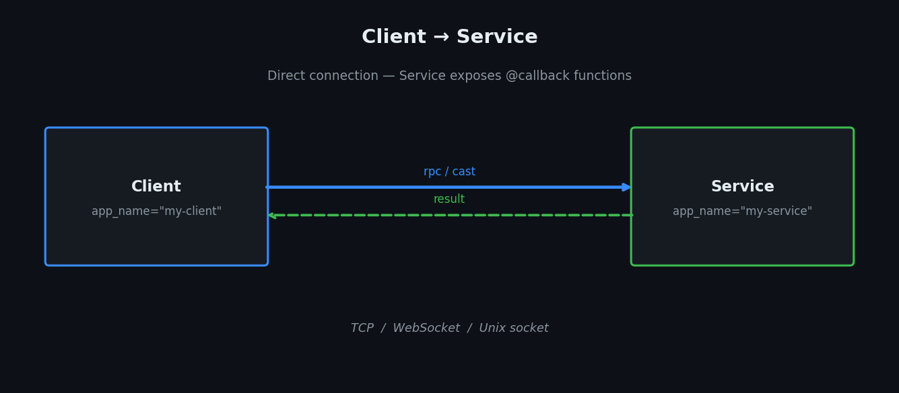

# Client → Service



The simplest daffi topology: a **Service** hosts `@callback` functions; **Clients** call them.

!!! note "Callbacks in the Service vs Router topology"
    In this topology Clients are pure callers — they connect to the Service and issue RPC calls,
    but do not expose their own callbacks.

    If you need Clients that *also* expose `@callback` functions (workers) or peers that call
    each other, use the [Router topology](router.md) instead.  In that model every `Client`
    can register callbacks and call other connected clients' callbacks through the Router.

---

## Service

```python
from daffi import Service, callback

@callback
def add(a: int, b: int) -> int:
    print(f"[service] add({a}, {b})")
    return a + b

@callback
def greet(name: str) -> str:
    return f"Hello, {name}!"

if __name__ == "__main__":
    svc = Service(
        app_name="calc-service",
        host="127.0.0.1",
        port=5001,
    )
    svc.start()
    print("Service running — press Ctrl+C to stop.")
    svc.join()   # blocks until Ctrl+C
```

### `Service` parameters

| Parameter | Type | Description |
|---|---|---|
| `app_name` | `str` | Unique name for this node. Auto-generated if omitted. |
| `host` | `str` | TCP host to listen on. |
| `port` | `int` | TCP port to listen on. |
| `unix_sock_path` | `os.PathLike` | Unix socket path (mutually exclusive with `host`/`port`). |
| `workers` | `int` | Number of threads executing incoming callbacks concurrently. Default: `1` (inline, no threads). |
| `tls` | `bool` | Enable TLS. Requires `cert_file` and `key_file`. |

---

## Client

```python
from daffi import Client

if __name__ == "__main__":
    client = Client(app_name="calc-client", host="127.0.0.1", port=5001)
    conn = client.connect()

    # Blocking call — waits for the result.
    result = conn.rpc(timeout=5).add(3, 4)
    print(f"add(3, 4) = {result}")          # → 7

    # Fire-and-forget — returns immediately.
    conn.rpc_nowait().greet("world")

    client.stop()
```

### `Client` parameters

| Parameter | Type | Description |
|---|---|---|
| `app_name` | `str` | Unique name for this node. |
| `host` | `str` | Service host to connect to. |
| `port` | `int` | Service port to connect to. |
| `unix_sock_path` | `os.PathLike` | Unix socket path (alternative to host/port). |

### `conn.rpc()`

```python
rpc = conn.rpc(timeout=5, receiver="calc-service")
result = rpc.add(3, 4)
```

| Option | Type | Description |
|---|---|---|
| `timeout` | `float \| None` | Seconds to wait for a result before raising. `None` = wait forever. |
| `receiver` | `str \| None` | Pin the call to a specific node by name. In the Service topology there is only one Service so this is optional. |
| `serde` | `SerdeFormat` | Serialisation format (default: `PICKLE`). |

### `conn.rpc_nowait()`

```python
conn.rpc_nowait().greet("world")
```

Same options as `rpc()` except `timeout` (ignored — no result is waited for).

---

## Callbacks in a class

Instead of decorating individual methods you can apply `@callback` to the **whole class**.  
daffi will instantiate the class (calling `__init__` with no arguments) and register every public method as a remote callback.

**Rules:**

- Methods whose names start with `_` are **skipped automatically**.
- Methods decorated with `@local` are **excluded** — they remain purely local.
- All other public methods become callable by remote clients.

```python
from daffi import Service, callback
from daffi.registry import local


@callback                          # ← decorate the class, not individual methods
class TextProcessor:
    def __init__(self):
        self._call_count = 0       # private — not exported

    def upper(self, text: str) -> str:
        self._call_count += 1
        return text.upper()

    def reverse(self, text: str) -> str:
        self._call_count += 1
        return text[::-1]

    def word_count(self, text: str) -> int:
        self._call_count += 1
        return len(text.split())

    @local
    def reset(self):
        """Not exported — only callable within this process."""
        self._call_count = 0


if __name__ == "__main__":
    svc = Service(app_name="text-service", host="127.0.0.1", port=5003)
    svc.start()
    svc.join()
```

The three public methods (`upper`, `reverse`, `word_count`) are registered as callbacks.  
`_call_count` (private attribute) and `reset` (`@local`) are never exposed to callers.

!!! tip
    The class must be constructable with **no arguments** when decorated at class level.  
    If you need to pass constructor arguments, initialise the object first and decorate its methods individually instead.

---

## cast() with a Service

`cast()` broadcasts to *all* nodes that expose the method and collects their results as a dict.  
When only one Service is running the dict has exactly one entry.

```python
conn = client.connect()

# Broadcast — returns {service_name: result}
results = conn.cast(timeout=5).notify("hello")
print(results)   # {"notify-service": "ack: hello"}

# Fire-and-forget broadcast
conn.cast_nowait().notify("ping")
```

See [Call Styles](call-styles.md) for a full comparison.

---

## stream() / stream_nowait() — generator streaming

Both methods iterate a generator and send each yielded value as a separate message to the remote callback (once per chunk, no results returned). They differ only in backpressure:

- **`stream()`** — waits for an ack from the service before sending the next chunk. Safe default.
- **`stream_nowait()`** — fire-and-forget per chunk. No ack, no backpressure. User controls rate.

Both default to `SerdeFormat.OPAQUE` (raw bytes, zero serialisation overhead).

**Service** — receives one chunk per invocation:

```python
from daffi import Service, callback

@callback
def receive_chunk(data: bytes) -> None:
    print(f"[service] received {len(data)} bytes: {data!r}")

svc = Service(app_name="stream-service", host="127.0.0.1", port=5010)
svc.start(); svc.join()
```

**Client** — streams a generator:

```python
from daffi import Client
from daffi.serialization import SerdeFormat

def data_source():
    for i in range(5):
        yield f"chunk-{i}".encode()

client = Client(app_name="stream-client", host="127.0.0.1", port=5010)
conn = client.connect()

conn.stream(serde=SerdeFormat.OPAQUE).receive_chunk(data_source())        # blocking, safe
conn.stream_nowait(serde=SerdeFormat.OPAQUE).receive_chunk(data_source())  # fire-and-forget
client.stop()
```

### Options

| Option | Type | Default | Description |
|---|---|---|---|
| `receiver` | `str \| None` | `None` | Pin to a specific worker by name. `None` picks one round-robin. |
| `serde` | `SerdeFormat` | `OPAQUE` | Serialisation format for each chunk. |
| `timeout` | `float \| None` | `None` | (`stream()` only) Seconds to wait per chunk ack. |

---

## Examples

| Example | Location |
|---|---|
| Basic rpc | `examples/service/01_rpc/` |
| cast / cast_nowait | `examples/service/02_cast/` |
| Class-based callbacks | `examples/service/03_class_callbacks/` |
| Pickle serde | `examples/service/04_serde_pickle/` |
| JSON serde | `examples/service/05_serde_json/` |
| OPAQUE serde | `examples/service/06_serde_opaque/` |
| MSGPACK serde | `examples/service/07_serde_msgpack/` |
| Unix socket | `examples/service/08_unix_socket/` |
| Events | `examples/service/09_events/` |
| Generator streaming | `examples/service/10_stream/` |
